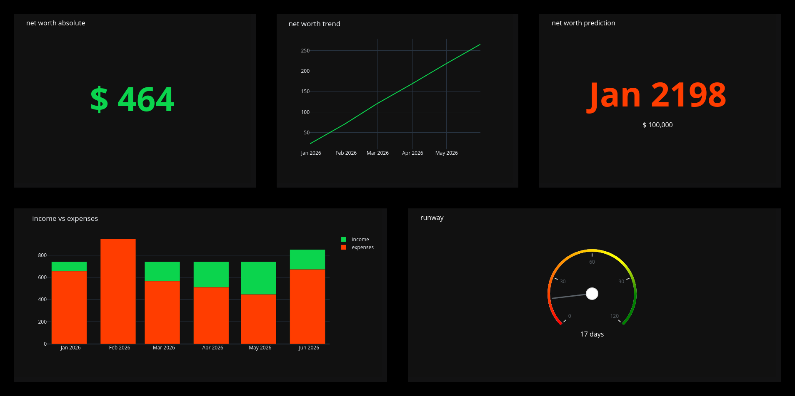

# GnuCash Dashboard



## Table of Contents

- [Metrics](#metrics)
- [Prerequisistes](#prerequisistes)
- [Start Dashboard](#start-Dashboard)
- [Configuration](#configuration)
- [Unit Testing](#unit-testing)
- [Acknowledgements](#acknowledgements)

## Metrics

### Net Worth Absolute

If I paid off all my liabilities right now, how much of my assets would remain?

```
net_worth = assets + liabilities
```

- 🟢 Good: Greater than 0.
- 🟠 Medium: Equals to 0.
- 🔴 Bad: Less than 0.

### Net Worth Trend

What is the net worth growth trend for the last n months?

```
net_worth_trend = linear_regression (assets_last_n_months + liabilities_last_n_months)

# Default: n months = 6
```

- 🟢 Good: Ascending slope.
- 🟠 Medium: Straight slope.
- 🔴 Bad: Decreasing slope.

### Net Worth Prediction

If my net worth keeps growing at the current rate, when will I achieve a certain goal?

```
net_worth_predicted_at_date = extrapolate(net_worth_trend, until=goal)

# Default: goal = 100_000
```

- 🟢 Good: Less than 10 years.
- 🟠 Medium: 10 to 20 years.
- 🔴 Bad: More than 20 years.

### Income vs. Expenses

This should be pretty self explanatory :)

### Runway

If my income stopped right now, how long would I be able to survive?

```
runway = assets / average_daily_expense_last_n_days

# Default: n days = 180
```

- 🟢 Good: More than 90 days.
- 🟠 Medium: 60 to 90 days.
- 🔴 Bad: Less than 60 days.

## Prerequisistes

- [GnuCash](https://gnucash.org/)
- [Python 3](https://www.python.org/)
- [GnuCash Python Bindings](https://wiki.gnucash.org/wiki/Python_Bindings)

### Dependencies

> **Please Note:** The following has been tested on elementary OS 6 (based on Ubuntu 20.04 LTS)

The GnuCash Python Bindings need the GnuCash to be installed from apt. So if you use the GnuCash Flatpak,
make sure to install the GnuCash *.deb package as well:

```bash
sudo apt install gnucash python3-gnucash python3-venv
```

## Start Dashboard

Once the dependencies are installed, navigate to the project root directory and execute the `start.sh` script,
it will install the python dependencies automatically and then run the application:

```bash
./start.sh
```

... your default browser should open at http://127.0.0.1:8050/ and point you at the GnuCash Dashboard.

## Configuration

### Using the `config.py` file

GnuCash Dashboard can be configured by changing the `config.py` file according to your needs. See the config file for further documentation.

### Using Environment Variables

Each variable from the `config.py` file can also be set as Environment Variable using a `GNUCASH2DASH_` prefix. See the `config.py` for
further documentation about the available configuration values as well as their corresponding Environment Variable.

## Unit Testing

GnuCash Dashboard comes with Unit Testing. To execute the tests, simply navigate to the project root directory and execute the `tests.sh`:

```bash
./tests.sh
```

## Acknowledgements

Thanks to Michael Walker for the inspiration on KPI's in Personal Finance. A lot of ideas are drawn from his [his approach](https://memo.barrucadu.co.uk/personal-finance.html).